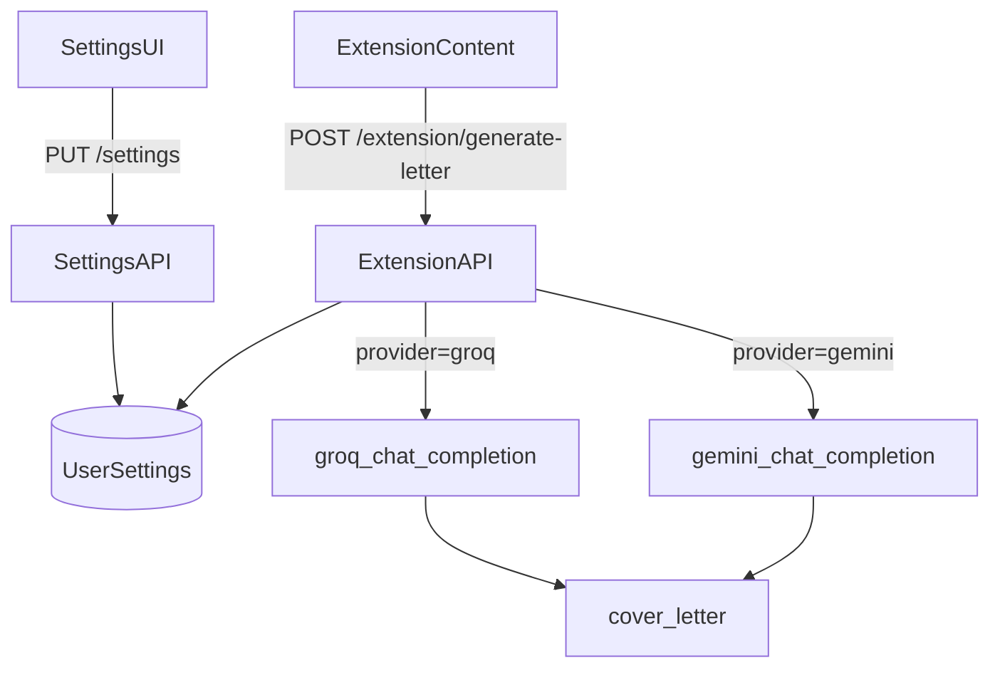

### Ключевые факты из текущего кода

- **Groq клиент**: `[c:\Users\Ixollozi\Cursor\JHunter\backend\groq_client.py](c:\Users\Ixollozi\Cursor\JHunter\backend\groq_client.py)` возвращает датакласс `GroqResult` (его будем использовать как общий `ChatResult` по ТЗ).
- **Шифрование**: `[c:\Users\Ixollozi\Cursor\JHunter\backend\crypto.py](c:\Users\Ixollozi\Cursor\JHunter\backend\crypto.py)` — `encrypt_secret/decrypt_secret` используют `GROQ_KEY_FERNET_SECRET`.
- **В config уже есть** `gemini_model = "gemini-2.5-flash"` (legacy), `groq_default_model` и Fernet secret: `[c:\Users\Ixollozi\Cursor\JHunter\backend\config.py](c:\Users\Ixollozi\Cursor\JHunter\backend\config.py)`
- **В requirements.txt нет `openai`**: `[c:\Users\Ixollozi\Cursor\JHunter\requirements.txt](c:\Users\Ixollozi\Cursor\JHunter\requirements.txt)`
- **Gemini OpenAI‑compat endpoint** (официальная дока Google AI): базовый URL `https://generativelanguage.googleapis.com/v1beta/openai/`, модель `gemini-2.0-flash` (`[ai.google.dev/gemini-api/docs/openai](https://ai.google.dev/gemini-api/docs/openai)`).

### Решения (фиксируем по твоим ответам)

- **Миграция ключа Gemini**: plaintext `user_settings.gemini_api_key` удаляем/заменяем на зашифрованное поле `gemini_api_key_enc` (данные plaintext не сохраняем).
- **Config для модели**: добавляем `gemini_default_model = "gemini-2.0-flash"` и используем его для нового провайдера; `gemini_model` оставляем как legacy (не ломаем возможные места, где он уже используется), но в генерации писем используем новое поле.

### Изменения по бэкенду

- **1) Новый клиент**: создать `[c:\Users\Ixollozi\Cursor\JHunter\backend\gemini_client.py](c:\Users\Ixollozi\Cursor\JHunter\backend\gemini_client.py)`
  - Реализовать `gemini_chat_completion(...) -> GroqResult` (переиспользуем датакласс из `groq_client.py`, чтобы совпадал формат результата).
  - Использовать **Python SDK `openai`** с `base_url="https://generativelanguage.googleapis.com/v1beta/openai/"`.
  - Парсить `text`, `usage.prompt_tokens/completion_tokens/total_tokens` аналогично Groq.
- **2) Зависимости**
  - Добавить `openai` в `[c:\Users\Ixollozi\Cursor\JHunter\requirements.txt](c:\Users\Ixollozi\Cursor\JHunter\requirements.txt)` (без фиксации версии, как сейчас).
- **3) Config**
  - В `[c:\Users\Ixollozi\Cursor\JHunter\backend\config.py](c:\Users\Ixollozi\Cursor\JHunter\backend\config.py)` добавить `gemini_default_model: str = "gemini-2.0-flash"`.
- **4) Модель БД**
  - В `[c:\Users\Ixollozi\Cursor\JHunter\backend\models.py](c:\Users\Ixollozi\Cursor\JHunter\backend\models.py)` в `UserSettings`:
    - добавить `letter_provider` (строка, значения `groq|gemini`, дефолт `groq`)
    - заменить plaintext `gemini_api_key` на `gemini_api_key_enc` (TEXT, nullable)
- **5) Alembic миграция**
  - Новый файл в `[c:\Users\Ixollozi\Cursor\JHunter\alembic\versions\](c:\Users\Ixollozi\Cursor\JHunter\alembic\versions\)`:
    - добавить `letter_provider` с default `'groq'`
    - добавить `gemini_api_key_enc` (TEXT nullable)
    - удалить `gemini_api_key` (plaintext)
- **6) Роутинг провайдера в генерации**
  - В `[c:\Users\Ixollozi\Cursor\JHunter\backend\letter_generation.py](c:\Users\Ixollozi\Cursor\JHunter\backend\letter_generation.py)`
    - импортировать `gemini_chat_completion`
    - расширить `generate_cover_letter(..., provider: str = "groq", model: str | None = None, ...)`
    - ветка `provider == "gemini"` вызывает `gemini_chat_completion(...)`
    - `get_quality_letter(..., provider: str = "groq", ...)` прокидывает вниз
    - Groq‑ветку не менять, только обернуть в `else`.
- **7) Settings API (сайт HHunter)**
  - В `[c:\Users\Ixollozi\Cursor\JHunter\backend\schemas.py](c:\Users\Ixollozi\Cursor\JHunter\backend\schemas.py)`
    - добавить `letter_provider` в `SettingsIn/SettingsOut` (валидация `groq|gemini`)
    - добавить `gemini_api_key` (input) как plaintext поле (как сейчас `groq_api_key`), но хранить будем в `gemini_api_key_enc`.
  - В `[c:\Users\Ixollozi\Cursor\JHunter\backend\routes_settings.py](c:\Users\Ixollozi\Cursor\JHunter\backend\routes_settings.py)`
    - сохранить `letter_provider` в `UserSettings`
    - добавить обработку `payload.gemini_api_key`: `encrypt_secret(...)` → `gemini_api_key_enc` / очистка
    - расширить `/settings/test-keys` или добавить отдельный тест для Gemini (лучше: расширить существующий ответ `{ groq:..., gemini:... }`).
- **8) Extension API (для автооткликов)**
  - В `[c:\Users\Ixollozi\Cursor\JHunter\backend\routes_extension.py](c:\Users\Ixollozi\Cursor\JHunter\backend\routes_extension.py)`
    - в `/extension/settings` отдавать выбранный `letter_provider` и флаг `gemini_configured` (опционально, если нужно UI расширения)
    - в `/extension/generate-letter`:
      - читать `st.letter_provider`
      - если `gemini`: расшифровать `st.gemini_api_key_enc`
      - передать `provider` в `get_quality_letter`
      - model: использовать `settings.gemini_default_model` (или `st.gemini_model` если появится позже; по ТЗ достаточно дефолта)

### Изменения по фронтенду (страница Настройки)

- Файл: `[c:\Users\Ixollozi\Cursor\JHunter\frontend\src\pages\Settings.jsx](c:\Users\Ixollozi\Cursor\JHunter\frontend\src\pages\Settings.jsx)`
  - Добавить селектор **Провайдер**: `Groq` / `Gemini`.
  - Если выбран `Gemini`:
    - показать поле ввода `Gemini API key`
    - кнопку «Проверить ключ» (вызывает новый/расширенный endpoint теста на сервере)
    - кнопку «Сохранить ключ» (как для Groq, но отправляет `gemini_api_key`)
    - показать ссылку `aistudio.google.com`.
  - Логику Groq UI оставить как есть.

### Мини‑диаграмма потока

### Тест-план (после внедрения)

- В UI выбрать `Gemini`, сохранить ключ, нажать «Проверить ключ».
- В `/extension/generate-letter` убедиться что ветка Gemini работает (письмо возвращается, `clean_letter/validate_letter` не трогаем).
- Вернуть `Groq` и убедиться что старый поток без регрессий.

