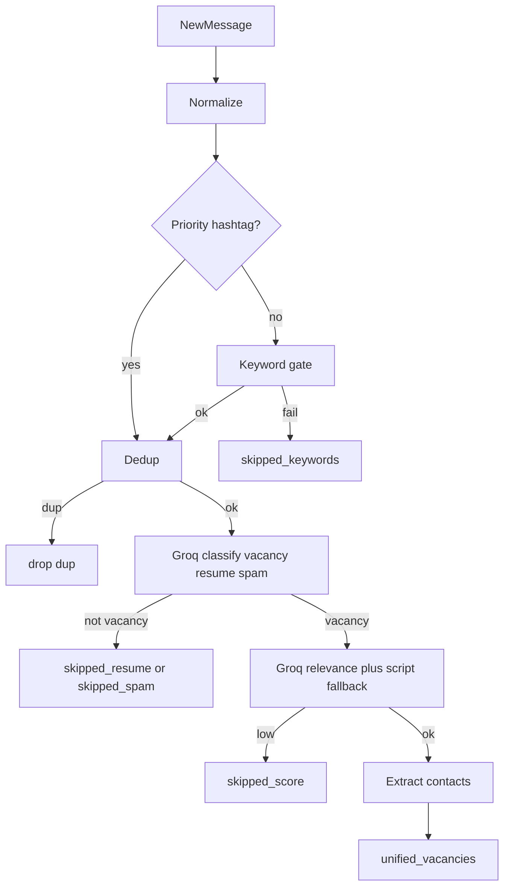
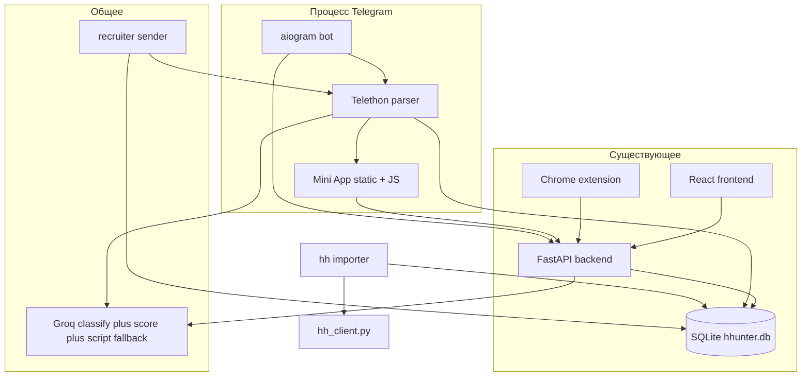

# Интеграция Telegram-парсера в JHunter

## Зафиксировано до разработки

1. **AI только Groq ([groq.com](https://groq.com))** для TG-pipeline: классификатор вакансия/резюме/спам и скоринг релевантности — через существующий **[backend/groq_client.py](backend/groq_client.py)** (при необходимости вынести общие промпты/парсинг ответа в соседний модуль **без** нового HTTP-клиента для другого провайдера). **xAI Grok из исходного ТЗ не внедряем**; файла `xai_grok_client.py` **нет**.
2. **Антиспам рекрутёрам:** окно **N = 7 дней по умолчанию**, хранение `tg_recruiter_cooldown_days`, смена в **Mini App**.
3. **Пустые ключевые слова:** бэкенд не режет поток; **Mini App** при первом добавлении канала (и при риске «весь канал без фильтра») показывает **предупреждение**, сохранение не обязательно блокировать.
4. **Порядок фаз:** объединение **двух процессов в `start.py`** — **последний шаг** (фаза 7); до этого runner только вручную.
5. **Парсинг:** обрабатывать **любые** сообщения в мониторимых peer’ах (не ограничиваться только постами админов), если иное не выяснится по ограничениям API.
6. **Gate по хештегам:** наличие в тексте (регистронезависимо) одного из `#vacancy`, `#вакансия`, `#job`, `#hiring`, `#работа` — **немедленный проход** этапа keyword gate **без** проверки пользовательских ключевых слов (самый надёжный сигнал).
7. **Два вызова Groq в TG-цепочке (нормальный режим):** (а) классификатор «вакансия / резюме / спам|другое» до сравнения с профилем; только `vacancy` дальше; (б) релевантность к профилю пользователя (оценка 0–100 или эквивалент в промпте) + **скриптовый fallback** из `relevance_score`. **Ослабленный режим (вариант B)** при недоступности Groq (сеть, 429, пустой ключ): **пропустить классификатор**, на **скоринге** полагаться на **fallback-скрипт** и порог — иначе `skipped_score` / drop.
8. **Userbot:** **личный** аккаунт (Telethon); **ровно один** клиент, только внутри `tg_bot/runner.py` (никогда из uvicorn); `StringSession` — зашифрованно, переподключение при обрыве.

## Финальный стек (ТЗ закрыто)


| Компонент                                   | Решение                                                                             |
| ------------------------------------------- | ----------------------------------------------------------------------------------- |
| AI классификатор (вакансия / резюме / спам) | **Groq**, `groq_client.py`                                                          |
| AI скоринг релевантности                    | **Groq** + **fallback-скрипт** (`relevance_score`)                                  |
| Fallback при недоступности Groq             | **Ослабленный режим B:** без классификатора, фильтрация только скриптовым скорингом |
| Парсинг / рассылка в TG                     | **Telethon**, личный аккаунт, тот же клиент для отправки рекрутёрам                 |
| БД                                          | **SQLite**, синхронный **SQLAlchemy**                                               |
| Интерфейс настроек TG                       | **Telegram Mini App** (+ веб-привязка аккаунта как в плане)                         |


Существующий код (например **Gemini** для писем в расширении hh) этим планом **не вычищается**; **всё новое и весь AI в цепочке Telegram → вакансия** — **только Groq** по таблице выше.

## Контекст репозитория

- **Backend**: [backend/main.py](backend/main.py) — FastAPI, SQLAlchemy, SQLite (`database/hhunter.db`), JWT-авторизация ([backend/auth.py](backend/auth.py), [backend/models.py](backend/models.py)).
- **HH**: поиск и карточки уже есть в [backend/hh_client.py](backend/hh_client.py) (`search_vacancies_page`, `get_vacancy_raw`, веб-SERP для демо).
- **Fallback-скоринг по ключевым словам**: реализован в [backend/routes_extension.py](backend/routes_extension.py) (`score_vacancy`, пресеты, `relevance_min_score` в `UserSettings`) — для единого pipeline его стоит **вынести** в маленький модуль (например `backend/relevance_score.py`), чтобы и расширение, и TG-пайплайн импортировали одну реализацию без циклических импортов.
- **AI для TG-pipeline:** только **Groq** — [backend/groq_client.py](backend/groq_client.py), ключ `groq_api_key_enc` и `groq_model` из `user_settings` (как у расширения). Иных AI-провайдеров для классификации/скоринга вакансий из TG **не** добавляем.
- **Отклики на hh**: серверный цикл заглушён в [backend/apply.py](backend/apply.py); расширение пишет в `applications`. TG-модуль **не заменяет** это, а дополняет воронку своими вакансиями и рассылкой в Telegram.

**Расхождение с ТЗ по стеку**: в проекте БД через **синхронный** SQLAlchemy, не `aiosqlite`. Имеет смысл оставить один стиль: **синхронные сессии** в воркерах Telethon/фоновых задачах (отдельный поток + `SessionLocal`), либо точечно `run_in_executor` из asyncio — без полной перестройки на async ORM.

## Запуск: два процесса из одной команды

**Порядок внедрения (зафиксировано):** этот блок реализуется **последним**, после появления рабочего `tg_bot.runner` и минимального функционала — иначе тестируется пустой дочерний процесс. До этого бот запускается вручную: `python -m tg_bot.runner`.

Цель: при обычном `python start.py` (или с явным флагом, если нужен opt-out) поднимаются **сразу два процесса**:

1. **Система** — как сейчас: uvicorn (FastAPI) + при dev-режиме Vite из [start.py](start.py).
2. **Telegram** — отдельный **дочерний процесс** `python -m tg_bot.runner` (или эквивалент): внутри asyncio-цикл с **aiogram** (бот) и **Telethon** (userbot / парсер каналов), общая точка входа, чтобы не плодить ручные терминалы.

Поведение:

- Родитель (`start.py`) после старта uvicorn (и при необходимости vite) делает `subprocess.Popen` для TG-процесса с тем же `cwd` и venv, что и основной запуск.
- При остановке (Ctrl+C / SIGTERM) — сначала корректно гасить дочерний процесс (Windows: та же process group или явный `terminate` + короткий join), затем остальное.
- **Reload uvicorn**: дочерний TG-процесс не должен плодиться при каждом перезапуске воркера — варианты: (а) флаг `--no-telegram` при `--reload` для разработки бэкенда без бота; (б) или один долгоживущий TG-процесс, не привязанный к reload (документировать). В плане реализации зафиксировать выбранный вариант в README.

Таким образом, оператору не нужно вручную открывать второй терминал для бота при локальной работе и простом деплое.

## Дополнения к ТЗ: управление каналами (Mini App)

- **Ввод**: пользователь вводит `@username` или ссылку вида `https://t.me/...` / `t.me/...` — нормализация до peer (username или invite hash по мере поддержки).
- **Резолв через Telethon**: после валидации строки бэкенд (через сервис с Telethon-сессией) вызывает `get_entity` / полные данные канала — **название** и **фото** (маленький аватар).
- **Хранение**: в `tg_monitored_channels` — `peer_id`/`access_hash` при необходимости, `username`, `display_title`, путь к **закешированному** файлу аватарки (или `file_unique_id` + периодическое обновление; прямые `file_id` Telethon не вечные — в плане реализации предпочтительно сохранять байты/JPEG в `data/tg_avatars/{user_id}/{channel_id}.jpg`).
- **Mini App UI**: не строка в списке, а **карточка**: аватар + отображаемое имя + @username; индикатор вкл/выкл.
- **Вкл/выкл без удаления**: поле `is_enabled` (boolean). Выключенный канал не подписывается в event handler / игнорируется при обработке; запись и настройки ключевых слов сохраняются.

API-эндпоинты (через initData Mini App или внутренний вызов из бота): `POST .../channels/preview`, `POST .../channels` (добавить), `PATCH .../channels/{id}` (`is_enabled`, `keywords`), `DELETE` опционально.

## Дополнения к ТЗ: стратегия gate (хештеги и ключевые слова)

**Уровень 0 — приоритетные хештеги (без пользовательских ключей):** если в объединённом тексте сообщения (текст + caption, нормализация пробелов/регистра для тега) есть хотя бы один из:

`#vacancy`, `#вакансия`, `#job`, `#hiring`, `#работа`

— сообщение **сразу считается прошедшим keyword gate** (никаких дополнительных совпадений с `tg_global_keywords` / `channel_keywords` не требуется).

**Уровень 1 — ключевые слова пользователя (если хештега нет):** как ранее:

- **Глобальные** в `user_settings` / `tg_settings` для каналов без своего списка.
- **На канале** — `channel_keywords`: если непусто, используется **только** он; иначе глобальные.
- Требование: **хотя бы одно** совпадение из эффективного списка (подстрока или целое слово — единая политика в коде). Не прошёл → **drop** (опционально запись/лог `skipped_keywords`).

**Порядок относительно AI:** оба уровня gate выполняются **до** любых вызовов **Groq** (классификатор и скоринг) — дешёвое отсечение.

- **Крайний случай (логика + UX)**:
  - **Бэкенд**: если эффективный список ключевых слов **пуст** (нет глобальных и у канала не задано своих) — пре-фильтр **не применяется** (все сообщения канала проходят дальше в пайплайн).
  - **Mini App (обязательно)**: при **первом добавлении канала** (или при сохранении канала без ключей, пока глобальный список тоже пуст) показывать **явное предупреждение**: без ключевых слов в поток попадёт весь контент канала; предложить задать глобальные слова или ключи для канала. Не блокировать сохранение жёстко (по желанию можно добавить чекбокс «понимаю риск»).

Для **hh-импорта** тот же приоритет хештегов (если есть в описании) + иначе глобальные/hh_keywords — в одной функции `passes_vacancy_gate` (общая с TG).

## AI: классификатор «вакансия vs резюме vs другое» (Groq; нормальный режим)

После **dedup по `text_hash`**, **до** скоринга релевантности к профилю:

- Один **короткий** вызов `**groq_chat_completion`** с промптом: класс `**vacancy`** | `**resume`** | `**spam`** | `**other`** (договориться о формате ответа, например одно слово или JSON).
- Если `**resume`**, `**spam`** или `**other**` — не вызывать Groq-скоринг по профилю; отбросить или записать `skipped_resume` / `skipped_spam` + `filter_reason`.
- Только `**vacancy**` → шаг **релевантности** (второй вызов Groq + при сбое/низком доверии — `relevance_score` и порог → `skipped_score`).

**Ослабленный режим (вариант B)** при недоступности Groq (ошибка сети, 429, нет ключа): **не** вызывать классификатор; сразу **скриптовый скоринг** + порог; не прошёл — `skipped_score` / drop. Логировать факт ослабленного режима для отладки.

## Итоговый pipeline (NewMessage → unified_vacancies)

```text
NewMessage
    │
    ▼
Нормализация текста (+ caption)
    │
    ▼
Хештег #vacancy / #вакансия / #job / #hiring / #работа ?
    │ да ───────────────────────────────┐
    │ нет                                │
    ▼                                    │
Keyword gate (глобальные / канальные)      │
    │ не прошёл → drop (skipped_keywords) │
    ▼                                    │
◄────────────────────────────────────────┘
    │
    ▼
Dedup (text_hash)
    │ дубль → drop
    ▼
Groq: вакансия / резюме / спам / другое ? (пропуск при режиме B)
    │ резюме → skipped_resume (или drop)
    │ спам/другое → skipped_spam (или drop)
    ▼
Groq + скриптовый fallback: соответствие профилю score 0–100
    │ score < порог → skipped_score
    ▼
Извлечь контакты (телефон, @username)
    │
    ▼
unified_vacancies (status: new / approved / sent / …)
```




## Целевая архитектура




Примечание: Mini App ходит в **FastAPI**; Telethon в дочернем процессе пишет в БД и может дергать внутренний HTTP или шарить только SQLite (достаточно БД + периодические задачи). Деталь связи бота с API — в реализации (общая БД минимизирует coupling).

## Привязка Telegram к веб-пользователю (выбранный вариант)

1. В **веб-настройках** ([frontend/src/pages/Settings.jsx](frontend/src/pages/Settings.jsx) + [backend/routes_settings.py](backend/routes_settings.py)): кнопка «Связать Telegram» → сервер генерирует **одноразовый код** (TTL 10–15 мин), хранит хэш в таблице `telegram_link_codes` или в Redis-подобном поле в SQLite.
2. Пользователь вводит код в **боте** → бот вызывает внутренний API или пишет в БД: `users.telegram_user_id`, `telegram_username`, время привязки; код помечается использованным.
3. **Mini App**: открывается только у привязанного `telegram_user_id`; бэкенд валидирует `initData` по [документации Telegram](https://core.telegram.org/bots/webapps#validating-data-received-via-the-mini-app) и сопоставляет с `users`.

## Схема данных (Alembic + [backend/models.py](backend/models.py))


| Таблица / поля                         | Назначение                                                                                                                                                                                                                                                   |
| -------------------------------------- | ------------------------------------------------------------------------------------------------------------------------------------------------------------------------------------------------------------------------------------------------------------ |
| Расширение `users`                     | `telegram_user_id` (unique, nullable), `telegram_linked_at`                                                                                                                                                                                                  |
| `user_settings` или JSON `tg_settings` | `tg_global_keywords`, `tg_recruiter_cooldown_days` (int, **дефолт 7**), шаблон сообщения, режим рассылки; N — в Mini App                                                                                                                                     |
| `tg_monitored_channels`                | `user_id`, peer, `username`, `display_title`, `avatar_storage_path`, `is_enabled`, `channel_keywords` (nullable), `created_at`                                                                                                                               |
| `unified_vacancies`                    | `user_id`, `source`, `text_hash`, тексты, метаданные, `score`, `filter_reason`, `status` (`new` / `approved` / `sent` / …), статусы отсева: `skipped_keywords`, `skipped_resume`, `skipped_spam`, `skipped_score` (или единое поле `status` + `skip_reason`) |
| `tg_sent_messages`                     | история рассылки                                                                                                                                                                                                                                             |
| `telegram_link_codes`                  | привязка веб ↔ TG                                                                                                                                                                                                                                            |


**Дедупликация TG**: `text_hash` + уникальность на `(user_id, text_hash)`.

**Антиспам (зафиксировано до разработки)**: не слать повторно одному и тому же рекрутёру (нормализованный телефон + lower(username)) чаще, чем раз в **N** календарных дней; **N = 7 по умолчанию**; поле `tg_recruiter_cooldown_days`; **редактирование в Mini App** (настройки / рассылка).

## Размещение кода в репозитории

- `tg_bot/` — `runner.py` (точка входа дочернего процесса: asyncio + aiogram + Telethon), handlers, keyboards.
- `tg_parser/` — `tg_parser.py`, `phone_extractor.py`, `hashtag_gate.py`, `keyword_gate.py`, контакты **после** успешного скоринга.
- `tg_filter/` — `groq_classify.py`, `groq_relevance.py`: обёртки над [backend/groq_client.py](backend/groq_client.py) + [backend/relevance_score.py](backend/relevance_score.py) (после выноса из `routes_extension`); режим B в одном месте переключения.
- `tg_sender/` — `recruiter_sender.py`.
- `tg_resume/` — парсинг PDF/docx.
- Статика Mini App + `StaticFiles` в FastAPI.

**Связь процессов**: TG-процесс читает/пишет ту же SQLite; для `channels/preview` возможен либо внутренний вызов Python из uvicorn (Telethon только в одном месте — тогда preview из API-процесса требует Telethon там же и **дублирование** клиента), либо preview выполняется **только** в TG-процессе через очередь/socket — проще для MVP: **один** Telethon-клиент в TG-процессе, а FastAPI кладёт задачу в таблицу `tg_channel_resolve_jobs` и опрашивает результат, либо admin вызывает бота. Чтобы упростить: **запускать Telethon и в API-процессе только для синхронных коротких `get_entity`** при наличии сессии — оценить риск двойного подключения к одной сессии (Telethon обычно не любит два процесса на один файл сессии). **Рекомендация в плане**: один файл сессии — **только в TG-процессе**; превью канала через **HTTP internal** от uvicorn к localhost-порту TG-сервиса или через БД job queue. Зафиксировать при реализации (минимум: очередь в SQLite + worker в tg процессе).

## Интеграция с hh «импорт»

- `tg_hh/importer.py`: [SearchConfig](backend/models.py) → `search_vacancies_page` / `get_vacancy_raw` → `unified_vacancies`, опционально тот же keyword gate по тексту.

## API для Mini App

- CRUD каналов, preview, глобальные/канальные ключевые слова, дашборд, вакансии, approve-очередь, экспорт.
- `initData` + CORS для `https://web.telegram.org` в [backend/main.py](backend/main.py).

## Зависимости и секреты

- `requirements.txt`: `aiogram>=3`, `telethon`; **Groq** уже в проекте (`groq`); при необходимости `python-docx`, `pymupdf` для резюме.
- `.env` / БД: `TELEGRAM_BOT_TOKEN`, `TELEGRAM_API_ID`, `TELEGRAM_API_HASH`; **StringSession** userbot — **зашифрованно** (как прочие секреты), переподключение при разрыве сессии.

## Фазы внедрения (порядок зафиксирован)

1. Миграции + модели (канал с аватаром, keywords, `is_enabled`, `tg_recruiter_cooldown_days` default 7; отдельный ключ под TG для Groq **не** вводим — тот же `groq_api_key_enc`).
2. Привязка TG ↔ web + бот базовый; ручной запуск `python -m tg_bot.runner` для разработки.
3. Хештег-gate + keyword gate + парсер (**все сообщения**), дедуп, джиттер 2–5 с, `FloodWaitError`; предупреждение Mini App при пустых ключах.
4. API превью канала + Mini App карточки и toggle; **N дней** антиспама в UI.
5. **Groq** в TG: **классификатор** + **релевантность** через `groq_client.py` + скриптовый fallback и **режим B** при недоступности; hh importer с тем же gate (хештеги + ключи).
6. Рассылка и остальной Mini App.
7. **Последним:** интеграция в [start.py](start.py) — два процесса из одной команды + обновление README (в т.ч. `--no-telegram`, ручной runner до шага 7).

## Риски и решения

### Инфраструктура и UI


| Риск                                | Подход                                                           |
| ----------------------------------- | ---------------------------------------------------------------- |
| Два процесса на одну SQLite         | Короткие транзакции; при необходимости **WAL** для SQLite        |
| Один session Telethon               | **Только** `tg_bot/runner.py`; не открывать клиент из uvicorn    |
| Telethon + uvicorn в одном процессе | Не смешивать; см. раздел «Запуск»                                |
| file_id аватарок                    | Кеш на диск + стабильный URL через FastAPI при отдаче в Mini App |


### Userbot и лимиты Telegram


| Риск                                    | Подход                                                                                                                                                                                                          |
| --------------------------------------- | --------------------------------------------------------------------------------------------------------------------------------------------------------------------------------------------------------------- |
| Бан / подозрение за агрессивный парсинг | **Случайная задержка 2–5 с** между «тяжёлыми» операциями; **не** опрашивать сотни каналов одновременно; ограничить параллелизм подписок/чтений                                                                  |
| FloodWait (флуд-контроль)               | Перехват `FloodWaitError`, ожидание `seconds` из исключения (с небольшим запасом), затем retry                                                                                                                  |
| Сессия протухла / обрыв                 | Зашифрованный **StringSession**, авто-**переподключение** при disconnect                                                                                                                                        |
| Два клиента на одну сессию              | Запрет: один Telethon-клиент, один процесс (**runner**)                                                                                                                                                         |
| Группы без вступления                   | **Публичные** каналы/супергруппы — обычно `get_entity` + подписка на updates **без** join; для частных / invite-only — проверять при реализации (может потребоваться вступление); задокументировать ограничения |


